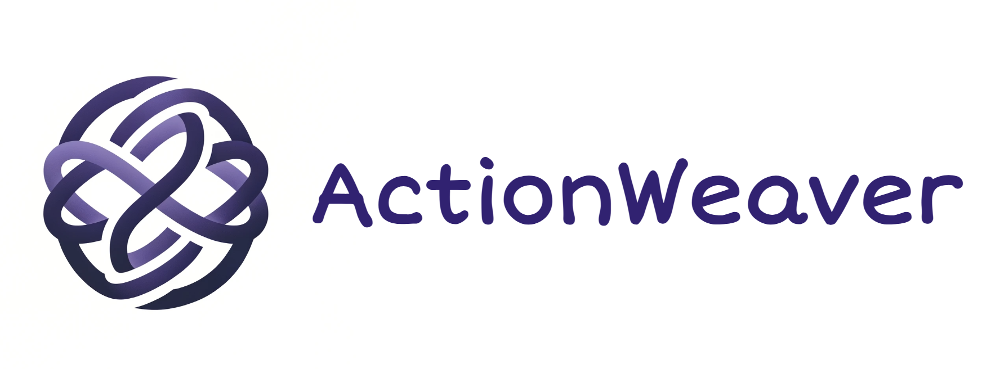
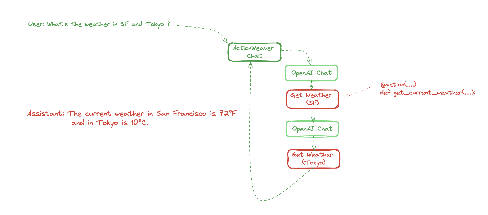

# ActionWeaver

🪡 AI application framework that puts function-calling as a first-class feature 🪡

**Supporting both OpenAI API and Azure OpenAI service!**

---
🚀  **[Explore Our Cookbooks For Tutorials & Examples!](https://actionweaver.readthedocs.io/en/latest/notebooks/cookbooks/cookbook.html)** 🚀 


Discord: https://discord.gg/fnsnBB99C2

**Considering about using LLM in your business or application ? We'd love to provide help and consultation, let's chat !**

Feel free to get in touch! Contact us at niel.hu@actionweaverai.com

---

To quickly become familiar with ActionWeaver, please take a look at notebooks listed below.
- [QuickStart](docs/source/notebooks/cookbooks/quickstart.ipynb)
- [Using Pydantic for Structured Data Parsing and Validation](docs/source/notebooks/cookbooks/pydantic.ipynb)
- [Function Validation with Pydantic and Exception Handler](docs/source/notebooks/cookbooks/data_validation_and_exception_handling.ipynb)
- [Built Traceable Action with LangSmith Tracing](docs/source/blogpost/langsmith.md)
- [Action Orchestration](docs/source/notebooks/cookbooks/orchestration.ipynb)
- [Stateful Agent](docs/source/notebooks/cookbooks/stateful_agent.ipynb)
  
---

[Star us on Github!](https://github.com/TengHu/ActionWeaver)

ActionWeaver is an AI application framework that is designed based on the concept of LLM function calling, while popular frameworks like Langchain and Haystack are built around the concept of pipelines. ActionWeaver strives to be the most reliable, user-friendly, high-speed, and cost-effective function-calling framework for AI engineers.

Our vision is to enable seamlessly merging traditional computing systems with the powerful reasoning capabilities of Language Model Models.

Features:
- **Function Calling as First-Class Citizen**: Put function-calling at the core of the framework.
- **Extensibility**: Integrate ANY Python code into your agent's toolbox with a single line of code, or combining tools from other ecosystems like LangChain or Llama Index.
- **Function Orchestration**: Build complex orchestration of function callings. including intricate hierarchies or chains.
- **Telemetry and Observability**: ActionWeaver's design places a strong emphasis on developer experience and efficiency. Take a look at [this link](https://actionweaver.readthedocs.io/en/latest/notebooks/cookbooks/logging.html) to see how ActionWeaver implements LLM telemetry, including tracing.


At a high level, ActionWeaver simplifies the process of creating functions, orchestrating them, and handling the invocation loop. An "action" in this context serves as an abstraction of functions or tools that users want the Language Model (LLM) to handle.




## Installation
You can install ActionWeaver using pip:

```python
pip install actionweaver
```
## Quickstart

Use the **LATEST** OpenAI API that supports parallel function calling !
```python
from actionweaver.llms import wrap
from openai import OpenAI

openai_client = wrap(OpenAI())
```

or using Azure OpenAI service to start a chat completion model
```python
import os
from openai import AzureOpenAI

azure_client = wrap(AzureOpenAI(
    azure_endpoint = os.getenv("AZURE_OPENAI_ENDPOINT"), 
    api_key=os.getenv("AZURE_OPENAI_KEY"),  
    api_version="2023-10-01-preview"
))
```


### Add ANY Python function as a tool to the Large Language Model.
Developers can attach **ANY** Python function as a tool with a simple decorator. In the following example, we introduce action `GetCurrentTime`, and then proceed to use the OpenAI API to invoke it.

ActionWeaver utilizes the decorated method's signature and docstring as a description, passing them along to OpenAI's function API. The Action decorator is also highly adaptable and can be combined with other decorators, provided that the original signature is preserved.

```python
from actionweaver import action

@action(name="GetCurrentTime")
def get_current_time() -> str:
    """
    Use this for getting the current time in the specified time zone.
    
    :return: A string representing the current time in the specified time zone.
    """
    import datetime
    current_time = datetime.datetime.now()
    
    return f"The current time is {current_time}"

# Ask LLM what time is it
response = openai_client.create(
  model="gpt-3.5-turbo",
  messages=[{"role": "user", "content": "what time is it"}],
  actions = [get_current_time]
)
```

### Easily integrate tools from libraries such as [Langchain](https://github.com/langchain-ai/langchain/tree/master/libs/community)

```python
from actionweaver.actions.factories.langchain import action_from_tool

from langchain_community.tools.google_search.tool import GoogleSearchRun
from langchain_community.utilities.google_search import GoogleSearchAPIWrapper

search_tool = GoogleSearchRun(api_wrapper=GoogleSearchAPIWrapper())

openai_client.create(
  model="gpt-3.5-turbo",
  messages=[{"role": "user", "content": "what date is today?"}],
  actions = [action_from_tool(search_tool)]
)
```

### Force execution of an action
You can also force the language model to execute the action. 
```python 
get_current_time.invoke(openai_client, messages=[{"role": "user", "content": "what time is it"}], model="gpt-3.5-turbo", stream=False, force=True)

```

### Structured extraction
You can create a Pydantic model to define the structure of the data you want to extract, and then force the language model to extract structured data from information in the prompt.

```python
from pydantic import BaseModel
from actionweaver.actions.factories.pydantic_model_to_action import action_from_model

class User(BaseModel):
    name: str
    age: int

action_from_model(User, stop=True).invoke(client, messages=[{"role": "user", "content": "Tom is 31 years old"}], model="gpt-3.5-turbo", stream=False, force=False)
```


##  Actions of Stateful Agent 

Developers also could create a class and enhance its functionality using ActionWeaver's action decorators.

```python
from openai import OpenAI
from actionweaver.llms import wrap
from actionweaver import action


class AgentV0:
    def __init__(self):
        self.llm = wrap(OpenAI())
        self.messages = []
        self.times = []
    
    def __call__(self, text):
        self.messages += [{"role": "user", "content":text}]
        return self.llm.chat.completions.create(model="gpt-3.5-turbo", messages=self.messages, actions = [self.get_current_time])
        
    @action(name="GetCurrentTime")
    def get_current_time(self) -> str:
        """
        Use this for getting the current time in the specified time zone.
        
        :return: A string representing the current time in the specified time zone.
        """
        import datetime
        current_time = datetime.datetime.now()

        self.times += [str(current_time)]
        
        return f"The current time is {current_time}"

agent = AgentV0()

agent("what time is it") # Output: 'The current time is 20:34.'

# You can invoke actions just like regular instance methods
agent.get_current_time() # Output: 'The current time is 20:34.'
```


##  Grouping and Extending Actions Through Inheritance

In this example, we wrap the [LangChain Google search](https://python.langchain.com/docs/integrations/tools/google_search) as a method, and define a new agent that inherits the previous agent and LangChain search tool. This approach leverages object-oriented principles to enable rapid development and easy expansion of the agent's capabilities.

In the example below, through inheritance, the new agent can utilize the Google search tool method as well as any other actions defined in the parent classes.
```python
class LangChainTools:
    @action(name="GoogleSearch")
    def google_search(self, query: str) -> str:
        """
        Perform a Google search using the provided query. 
        
        This action requires `langchain` and `google-api-python-client` installed, and GOOGLE_API_KEY, GOOGLE_CSE_ID environment variables.
        See https://python.langchain.com/docs/integrations/tools/google_search.

        :param query: The search query to be used for the Google search.
        :return: The search results as a string.
        """
        from langchain.utilities import GoogleSearchAPIWrapper

        search = GoogleSearchAPIWrapper()
        return search.run(query)
    
class AgentV1(AgentV0, LangChainTools):
    def __call__(self, text):
        self.messages += [{"role": "user", "content":text}]
        return self.llm.chat.completions.create(model="gpt-3.5-turbo", messages=self.messages, actions = [self.google_search])

agent = AgentV1()
agent("what happened today")

"""
Output: Here are some events that happened or are scheduled for today (August 23, 2023):\n\n1. Agreement State Event: Event Number 56678 - Maine Radiation Control Program.\n2. Childbirth Class - August 23, 2023, at 6:00 pm.\n3. No events scheduled for August 23, 2023, at Ambassador.\n4. Fine Arts - Late Start.\n5. Millersville University events.\n6. Regular City Council Meeting - August 23, 2023, at 10:00 AM.\n\nPlease note that these are just a few examples, and there may be other events happening as well.
"""
```

## Orchestration of Actions (Experimental)

ActionWeaver enables the design of hierarchies and chains of actions by passing in `orch` argument. `orch` is a mapping from actions as keys to values including

-  a list of actions: if the key action is invoked, LLM will proceed to choose an action from the provided list, or respond with a text message.
-  an action: after key action is invoked, LLM will invoke the value action.
-  None: after key action is invoked, LLM will respond with a text message.


For example, let's say we have actions a1, a2, a3.
 
```python
client.create(
    [
        {"role": "user", "content": "message"} 
    ],
    actions=[a1, a2, a3], # First, LLM respond with either a1, a2 or a3, or text without action
    # Define the orchestration logic for actions:
    orch={
        a1.name: [a2, a3],  # If a1 is invoked, the next response will be either a2, a3 or a text response.
        a2.name: a3,      # If a2 is invoked, the next action will be a3
        a3.name: [a4]     # If a3 is invoked, the next response will be a4 or a text response.
        a4.name: None     # If a4 is invoked, the next response will guarantee to be a text message
    }
)
```


### Example: Hierarchy of Actions

Instead of overwhelming OpenAI with an extensive list of functions, we can design a hierarchy of actions. In this example, we introduce a new class that defines three specific actions, reflecting a hierarchical approach:


```python
from typing import List
import os
class FileAgent(AgentV0):
    @action(name="FileHandler")
    def handle_file(self, instruction: str) -> str:
        """
        Handles ALL user instructions related to file operations.
    
        Args:
            instruction (str): The user's instruction about file handling.
    
        Returns:
            str: The response to the user's question.
        """
        print (f"Handling {instruction}")
        return instruction
        

    @action(name="ListFiles")
    def list_all_files_in_repo(self, repo_path: str ='.') -> List:
        """
        Lists all the files in the given repository.
    
        :param repo_path: Path to the repository. Defaults to the current directory.
        :return: List of file paths.
        """

        print(f"list_all_files_in_repo: {repo_path}")
        
        file_list = []
        for root, _, files in os.walk(repo_path):
            for file in files:
                file_list.append(os.path.join(root, file))
            break
        return file_list

    @action(name="ReadFile")
    def read_from_file(self, file_path: str) -> str:
        """
        Reads the content of a file and returns it as a string.
    
        :param file_path: The path to the file that needs to be read.
        :return: A string containing the content of the file.
        """
        print(f"read_from_file: {file_path}")
        
        with open(file_path, 'r') as file:
            content = file.read()
        return f"The file content: \n{content}"

    def __call__(self, text):
        self.messages += [{"role": "user", "content":text}]
        return self.llm.chat.completions.create(model="gpt-3.5-turbo", messages=self.messages, actions = [self.list_all_files_in_repo], orch = {self.handle_file.name: [self.list_all_files_in_repo, self.read_from_file]})
```

## Contributing
Contributions in the form of bug fixes, new features, documentation improvements, and pull requests are VERY welcomed.

## 📔 Citation & Acknowledgements

If you find ActionWeaver useful, please consider citing the project:

```bash
@software{Teng_Hu_ActionWeaver_2024,
    author = {Teng Hu},
    license = {Apache-2.0},
    month = Aug,
    title = {ActionWeaver: Application Framework for LLMs},
    url = {https://github.com/TengHu/ActionWeaver},
    year = {2023}
}
```
