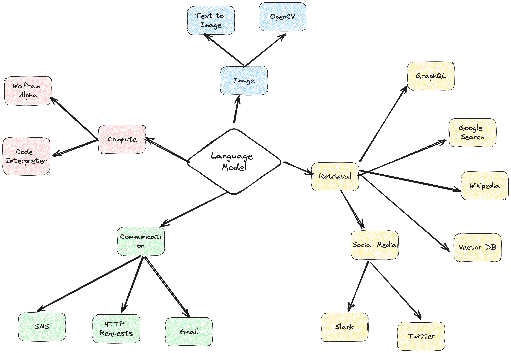

# ActionWeaver


🪡 A framework for building AI agents from orchestration, scaling, and advanced features of LLM function-calling capabilities. 🪡


Features:
- **Function Calling as First-Class Citizen**: Put function-calling at the core of the framework.
- **Extensibility**: Easily integrate ANY Python code into your agent's toolbox with just a single line of code, or combining functions/tools from other ecosystems like LangChain or Llama Index.
- **Function Orchestration**: Build complex orchestration of function callings. including intricate hierarchies or chains.
- **Debuggability**: ActionWeaver adopts structured logging, making the developer experience more efficient.


ActionWeaver is an AI agent framework that is designed based on the concept of LLM function calling, while popular frameworks like Langchain and Haystack are built around the concept of pipelines. ActionWeaver strives to be the most reliable, user-friendly, high-speed, and cost-effective function-calling framework for AI engineers.

Our vision is to pioneer a new era in program development by seamlessly merging traditional programming techniques with the powerful reasoning capabilities of Language Model Models.

**[More use cases and demos](docs/source/notebooks/use_cases.ipynb)**

## Installation
You can install ActionWeaver using pip:

```python
pip install actionweaver
```

## Quickstart

Developers can attach **ANY** Python function in your OpenAI calls as a function to be invoked by the LLM with a simple decorator. In the following example, we introduce two actions, `GetCurrentTime` and `Sleep`, and then proceed to utilize the OpenAI API in conjunction with these corresponding functions.

ActionWeaver utilizes the decorated method's signature and docstring as a description, passing them along to OpenAI's function API. The Action decorator is also highly adaptable and can be combined with other decorators, provided that the original signature is preserved.

```python
@action(name="GetCurrentTime")
def get_current_time() -> str:
    """
    Use this for getting the current time in the specified time zone.
    
    :return: A string representing the current time in the specified time zone.
    """
    import datetime
    current_time = datetime.datetime.now()
    
    return f"The current time is {current_time}"


@action(name="Sleep")
def sleep(seconds: int) -> str:
    """
    Introduces a sleep delay of the specified seconds and returns a message.

    Args:
        seconds (int): The duration to sleep in seconds.

    Returns:
        str: A message indicating the completion of the sleep.
    """
    import time
    time.sleep(seconds)
    return f"Now I wake up after sleep {seconds} seconds."

chat = OpenAIChatCompletion("gpt-3.5-turbo", token_usage_tracker = TokenUsageTracker(budget=2000, logger=logger), logger=logger)
chat.create([{"role": "user", "content": "what time is it now"}], actions = [sleep, get_current_time])
```

See **[example notebook](docs/source/notebooks/quickstart.ipynb)**

##  Actions of Stateful Agent 

Developers also have the option to create an agent class and enhance its functionality using ActionWeaver's action decorators. These decorators allow actions to modify the state of the agent instance.

```python
class AgentV0:
    def __init__(self, logger):
        self.logger = logger
        self.token_tracker = TokenUsageTracker(budget=None, logger=logger)
        self.llm = OpenAIChatCompletion("gpt-3.5-turbo", token_usage_tracker = self.token_tracker, logger=logger)
        
        self.messages = [{"role": "system", "content": "You are a resourceful assistant, able to inquire for more information if you cannot provide a confident answer to a question."}]
        self.times = []
    
    def __call__(self, text):
        self.messages += [{"role": "user", "content":text}]
        return self.llm.create(messages=self.messages, actions = [self.get_current_time])
        
    @action(name="GetCurrentTime")
    def get_current_time(self) -> str:
        """
        Use this for getting the current time in the specified time zone.
        
        :return: A string representing the current time in the specified time zone.
        """
        import datetime
        current_time = datetime.datetime.now()

        self.times += [str(current_time)]
        
        return f"The current time is {current_time}"

agent = AgentV0(logger)
```
You can invoke actions just like regular instance methods
```python
agent.get_current_time() # Output: 'The current time is 20:34.'
```


See **[example notebook](docs/source/notebooks/stateful_agent.ipynb)**

##  Grouping and Extending Actions Through Inheritance

In this example, we wrap the [LangChain Google search](https://python.langchain.com/docs/integrations/tools/google_search) as a method, creating a powerful and extensible design pattern. By defining a new agent that inherits from the previous agent and LangChainTools, the new agent will inherit actions from both classes. This approach leverages object-oriented principles to enable rapid development and easy expansion of the agent's capabilities.

In the example below, through inheritance, the new agent can utilize the Google search tool method as well as any other actions defined in the parent classes. This structure makes it simple to build upon existing code.


```python
class LangChainTools:
    @action(name="GoogleSearch")
    def google_search(self, query: str) -> str:
        """
        Perform a Google search using the provided query. 
        
        This action requires `langchain` and `google-api-python-client` installed, and GOOGLE_API_KEY, GOOGLE_CSE_ID environment variables.
        See https://python.langchain.com/docs/integrations/tools/google_search.

        :param query: The search query to be used for the Google search.
        :return: The search results as a string.
        """
        from langchain.utilities import GoogleSearchAPIWrapper

        search = GoogleSearchAPIWrapper()
        return search.run(query)
    
class AgentV1(AgentV0, LangChainTools):
    def __call__(self, text):
        self.messages += [{"role": "user", "content":text}]
        return self.llm.create(messages=self.messages, actions = [self.google_search, self.get_current_time])

agent = AgentV1(logger)
agent("what happened today")

"""
Output: Here are some events that happened or are scheduled for today (August 23, 2023):\n\n1. Agreement State Event: Event Number 56678 - Maine Radiation Control Program.\n2. Childbirth Class - August 23, 2023, at 6:00 pm.\n3. No events scheduled for August 23, 2023, at Ambassador.\n4. Fine Arts - Late Start.\n5. Millersville University events.\n6. Regular City Council Meeting - August 23, 2023, at 10:00 AM.\n\nPlease note that these are just a few examples, and there may be other events happening as well.
"""
```

## Orchestration of Actions

ActionWeaver enables the design of hierarchies and chains of actions with following features:

**Scope**: Each action is confined to its own visibility scope.

**Orchestration expression**:

1. **SelectOne(['a1', 'a2', 'a3])**: Prompting the llm to choose either 'a2' or 'a3' after 'a1' has been invoked, or to take no action.
   
2. **RequireNext(['a1', 'a2', 'a3])**: Mandating the language model to execute 'a2' immediately following 'a1', followed by 'a3'.


### Example: Hierarchy of Actions

Instead of overwhelming OpenAI with an extensive list of functions, we can design a hierarchy of actions. In this example, we introduce a new class that defines three specific actions, reflecting a hierarchical approach:

- FileHandler with `default` scope: This action serves as the entry point for all file-manipulating actions, with orchestration logic `SelectOne(["FileHandler", "ListFiles", "ReadFile"])`.

- ListFiles with `file` scope.
- ReadFile with `file` scope.


```python
class FileUtility(AgentV0):
    @action(name="FileHandler", orch_expr = SelectOne(["FileHandler", "ListFiles", "ReadFile"]))
    def handle_file(self, instruction: str) -> str:
        """
        Handles user instructions related to file operations. Put every context in the instruction only!
    
        Args:
            instruction (str): The user's instruction about file handling.
    
        Returns:
            str: The response to the user's question.
        """
        return instruction
        

    @action(name="ListFiles", scope="file")
    def list_all_files_in_repo(self, repo_path: str ='.') -> List:
        """
        Lists all the files in the given repository.
    
        :param repo_path: Path to the repository. Defaults to the current directory.
        :return: List of file paths.
        """

        logger.info(f"list_all_files_in_repo: {repo_path}")
        
        file_list = []
        for root, _, files in os.walk(repo_path):
            for file in files:
                file_list.append(os.path.join(root, file))
            break
        return file_list

    @action(name="ReadFile", scope="file")
    def read_from_file(self, file_path: str) -> str:
        """
        Reads the content of a file and returns it as a string.
    
        :param file_path: The path to the file that needs to be read.
        :return: A string containing the content of the file.
        """
        logger.info(f"read_from_file: {file_path}")
        
        with open(file_path, 'r') as file:
            content = file.read()
        return f"The file content: \n{content}"
```

### Example: Chains of Actions

We can also force LLM to ask for current time after read a file by setting orchestration in `ReadFile`.

```python
class FileUtility(AgentV0):
    @action(name="ReadFile", scope="file", orch_expr = RequireNext(["ReadFile", "GetCurrentTime"]))
    def read_from_file(self, file_path: str) -> str:
        """
        Reads the content of a file and returns it as a string.
    
        :param file_path: The path to the file that needs to be read.
        :return: A string containing the content of the file.
        """
        logger.info(f"read_from_file: {file_path}")
        
        with open(file_path, 'r') as file:
            content = file.read()
        return f"The file content: \n{content}"

agent = FileUtility(logger)
```

## Roadmap

- support multiple action calling in one function.
- support async function calling.
- function server with open source language model.

## Contributing
Contributions in the form of bug fixes, new features, documentation improvements, and pull requests are VERY welcomed.

## 📔 Citation & Acknowledgements

If you find ActionWeaver useful, please consider citing the project:

```bash
@software{Teng_Hu_ActionWeaver_2023,
    author = {Teng Hu},
    license = {Apache-2.0},
    month = Aug,
    title = {ActionWeaver: Application Framework for LLMs},
    url = {https://github.com/TengHu/ActionWeaver},
    year = {2023}
}
```

