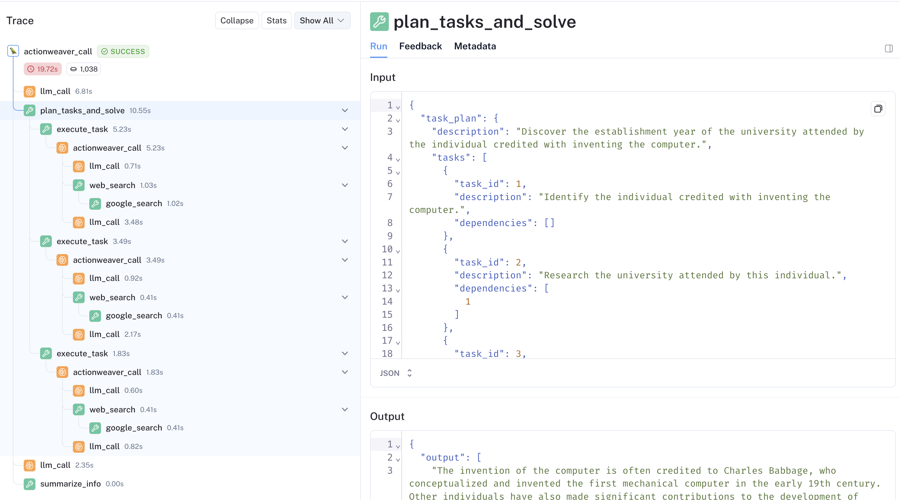

# Function Tracing with LangSmith


In this post, we are going to build a task planning agent with ActionWeaver and LangSmith for better debugging and tracing capabilities!


- [ActionWeaver](https://github.com/TengHu/ActionWeaver) simplifies the development of LLM applications by providing straightforward tools for structured data parsing, function dispatching and orchestration.
- [LangSmith](https://www.langchain.com/langsmith) is a popular platform for debug, trace, test and evaluation for intelligence agent applications, developed by LangChain.

Because ActionWeaver's just a lightweight framework centered around functions calling with LLM, the integration between two is seamless and almost native! 


By the end of this blog post, you will learn how to effectively use the LangSmith tracing with ActionWeaver. For the complete working notebook, please refer to [here](https://actionweaver.readthedocs.io/en/latest/notebooks/cookbooks/langsmith.html)


Let's first explore some basic concepts first.

- `action`: A fundamental component in ActionWeaver, it represents a tool that can be used by LLM. Each action comprises two main elements: a Pydantic model that is generated to facilitate structured prompting, and a conventional Python function.


## Wrap the OpenAI client with ActionWeaver and LangSmith for traceability.
To start, let's

- Import and LangSmith `traceable` to the OpenAI client's `client.chat.completions.create` method to enable OpenAI API call tracing.
- Wrap the OpenAI client to leverage all ActionWeaver features. Through wrapping your LLM client with ActionWeaver, it takes charge of function/tool prompting and the function calling loop. Additionally, it provides control mechanisms such as 'orchestration' to manage the sequence of functions presented to the LLM.
- Finally, Apply the `traceable` to ActionWeaver-wrapped client's `client.create` method to ensure tracing on top level `client.create` call.

```python
from langsmith import traceable
from actionweaver.llms import wrap
from openai import OpenAI

client = OpenAI()

# Apply LangSmith tracing to the original LLM  client's chat completion method.
# This allows for detailed tracking of API calls to OpenAI.
client.chat.completions.create = traceable(name="llm_call", run_type="llm")(client.chat.completions.create)

# Enhance the LLM client with ActionWeaver.
llm = wrap(client)

# Track ActionWeaver wrapped create method with LangSmith tracing to monitor ActionWeaver calls.
llm.create = traceable(name="actionweaver_call", run_type="llm")(llm.create)
```

## Tracing Actions
 You can easily turn any python function into an action through `action` decorator. In addition, by applying LangSmith `traceable` function, you can convert it into a traceable action. That's all it takes to create a traceable action from a Python function!
 
> **Note**:
We pass the `traceable` parameter into the action decorators instead of using regular Python decoration because ActionWeaver generates a Pydantic model from the function signature, and we want to exclude `traceable` from the Pydantic model.


Example:
```python
@action(name="GoogleSearch", decorators=[traceable(run_type="tool")])
def web_search(query: str) -> str:
    """
    Perform a Google search using the provided query. 
    """
    return google_search_api(query)
```

Then, let's we create an agent `TaskPlanner` that ask LLM to perform two actions `plan_tasks_and_solve` and `summarize_info` through function callings.

To ensure the integrity of the inputs passed to these functions, we're including Pydantic `validate_call` for input validation. 

> **Note**
The orchestration of function calls is managed by the `orch` parameter, designed as follows:
```python
orch = {
    DEFAULT_ACTION_SCOPE: self.plan_tasks_and_solve,
    self.plan_tasks_and_solve.name: self.summarize_info,
}
```

This configuration instructs the LLM to first execute the plan_tasks_and_solve action, followed by the summarize_info action to condense the results and present them directly to the user. For further details on function orchestration, refer to [ActionWeaver](https://github.com/TengHu/ActionWeaver?tab=readme-ov-file#orchestration-of-actions-experimental)


A sketch implementation of the TaskPlanner class:
```python 
class TaskPlanner:
    def __init__(self, llm, eh):
        self.llm = llm
        self.debug_info = {}
        self.eh = eh
        self.messages = [
            {"role": "system", "content": "You are a task planner, approach the question by breaking it into smaller tasks and addressing each step systematically"},
        ]

    def __call__(self, query:str) -> str:
        self.messages.append({"role": "user", "content": query})
        response = llm.create(
          model=MODEL,
          messages=self.messages,
          stream=False, 
          exception_handler = self.eh,
          orch = {
              DEFAULT_ACTION_SCOPE: self.plan_tasks_and_solve,
              self.plan_tasks_and_solve.name: self.summarize_info,
          }
        )
        return response

    @action(name="Summarize", stop=True, decorators=[traceable(run_type="tool")])
    @validate_call
    def summarize_info(self, content: str) -> str:
        """Condense the information to provide a concise response to the question."""
        return content

    @action(name="CreateAndExecutePlan", decorators=[traceable(run_type="tool")])
    @validate_call
    def plan_tasks_and_solve(self, task_plan: TaskPlan) -> str:
        """Create and execute a plan for complex problem"""
        ...
```

Let's ask a question to the TaskPlanner and see how it works through tracing, this helps us understand how the agent gets to the final answer, and how we can optimize it for better performance!

```python
response = task_planner("""Discover the establishment year of the university attended by the individual credited with inventing the computer.""")
```

[LangSmith Trace](https://smith.langchain.com/public/3d3a6e18-79f6-44b1-9efc-ee8f9b1df587/r):




For the complete working notebook, please refer to [here](https://actionweaver.readthedocs.io/en/latest/notebooks/cookbooks/langsmith.html)

